# Quant_Detect

In this paper we discuss how the intelligent models like AutoEncoders, Variational Auto Encoders (VAE) and Generative Adversarial Networks (GANs) can be systematically exploited by adversaries to manipulate observable network parameters while preserving statistical plausibility. Unlike conventional attacks that induce abrupt or out-of-distribution anomalies, these models enable the synthesis of network states that remain consistent with learned data manifolds, thereby evading classical threshold-based and rule-driven detection mechanisms. Such attacks can subtly perturb critical parameters including received signal strength indicators (RSSI), signal-to-interference-plus-noise ratios (SINR), channel quality indicators (CQI), traffic load metrics, and mobility features, ultimately misleading learning-driven radio resource management, self-organizing network controllers, and anomaly monitors. By formalizing this threat model, we expose a fundamental vulnerability in data-driven network intelligence and motivate the need for geometry-aware detection mechanisms that operate beyond marginal consistency.

# The Attack Model
## AutoEncoder
### Example Scenario
Consider a scheduler that allocates additional PRBs only when the reported cell load is below a congestion threshold and the reported average SINR exceeds a minimum quality requirement. Under the true network conditions generated by the simulator, the cell operates in a congested regime with state [0.82,0.06,17.5,460,16], indicating high and increasing load, poor average SINR, and large SINR dispersion due to interference. Based on this state, a rational scheduler would deny additional resource allocation. The attacker cannot alter the physical channel or interference but instead manipulates the reported network state. Using an autoencoder trained on benign observations, the attacker obtains a normal-looking reference [0.64,0.01,26.0,180,14] and reports an attacked state 
[0.75,0.04,20.9,348,15.2]. Each reported metric remains within historically observed ranges, yet the joint physical consistency is violated, as SINR quality appears to improve despite sustained high contention. When the scheduler evaluates this attacked state, the reported load now falls below the congestion threshold and the reported SINR exceeds the quality requirement, causing the scheduler to allocate additional PRBs that would have been denied under the true state. These extra resources are therefore extracted purely through perception-layer manipulation, not through genuine capacity or channel improvement, and conventional threshold- or distribution-based checks fail to detect the attack because the reported metrics remain statistically plausible.

| Time Domain of AE Plot | Load–SINR decision-space plot | Latent Geometry Plot of AE |
| :---: | :---: | :---: | 
| 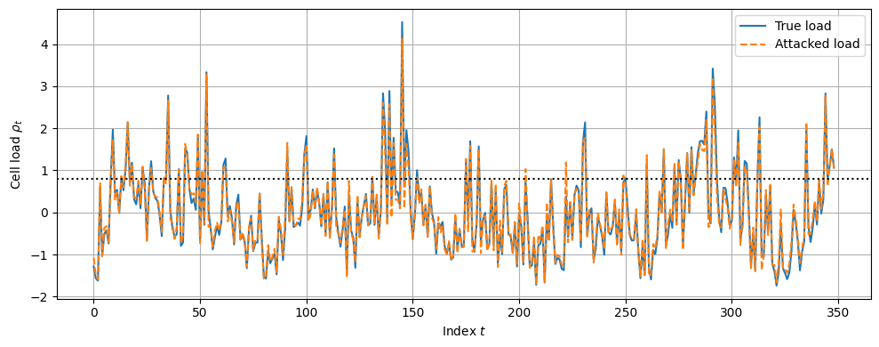 | 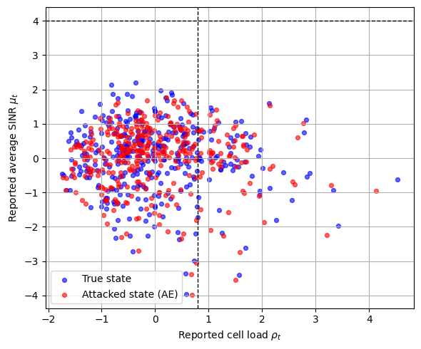 | 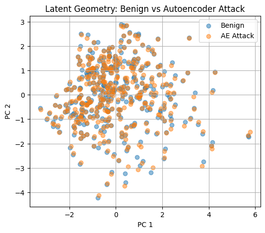 |

The first figure shows the same network over time, with two curves: Blue (True load): the real cell load produced by your simulator and Orange (Attacked load): the load reported after the AE attackThey almost overlap, which is important. It means the attacker is not injecting noise or making big, obvious changes. However, if you look closely, the orange curve is slightly biased downward during many high-load periods. In other words, when the cell is actually stressed, the reported load is nudged to look a bit healthier. Thus, the attacker subtly reduces the perceived congestion of the cell while preserving temporal continuity and trends. This is the stealth.

The second figure shows the reported network states in the [𝜌_t, μ_t]  decision space, which denotes the reported cell load and the reported average SINR respectievely. Blue points correspond to the true states generated by the network simulator, while red points denote the states reported under the autoencoder-based attack. The dashed lines indicate typical scheduling thresholds separating congested from allocatable operating regions. Although the attacked states remain statistically close to the benign manifold, a subset of samples is shifted across the decision boundary, causing the controller to misclassify physically congested conditions as moderate operation. This boundary crossing directly explains how the attacker induces excess resource allocation without altering the underlying network dynamics.

The third figure illustrates the low-dimensional latent geometry of benign network states and autoencoder-based attacked states obtained via principal component analysis. Despite inducing decision-level misclassification, the attacked samples remain embedded within the benign manifold and exhibit significant overlap with normal observations. This confirms that the attacker preserves marginal statistics and global data geometry, rendering classical distance- or clustering-based detection ineffective.

Together, these figures illustrates the effect of the autoencoder-based perception attack on resource allocation decisions. Although the attacked load trajectory closely follows the true load over time, the reported values are subtly biased toward lower congestion. In the load–SINR decision space, this bias causes multiple network states to cross implicit scheduling thresholds, leading the controller to misclassify congested conditions as moderate operation. As a result, additional resources are allocated under the attacked perception despite unchanged physical conditions, enabling stealthy resource extraction without triggering conventional anomaly checks.

>*These three figures collectively illustrate the stealth–impact tradeoff of the proposed perception-layer attack.
> While the attacked load trajectory closely follows the true network evolution over time, subtle shifts in the reported load–SINR space cause multiple states to cross scheduling decision boundaries, leading to excess resource allocation.
> At the same time, the attacked states remain embedded within the benign data manifold in latent space, explaining why conventional statistical or clustering-based detectors fail to identify the attack*

## Variational AutoEnoder (VAE)
Unlike the autoencoder, the VAE does not learn a single deterministic projection of a network state. Instead, it learns a probabilistic latent distribution of benign states and generates attacked samples by sampling from that distribution. This means the VAE attack does not merely “smooth” an observed state toward normality; it actively re-randomizes the state within the support of benign data. As a result, VAE-generated states preserve global statistics and density very well, but they are less tightly anchored to the original physical realization.

| Latent Geometry Plot| load–SINR decision-space plot |per-state plots | Marginal distribution plot|
| :---: | :---: | :---: | :---: |
| 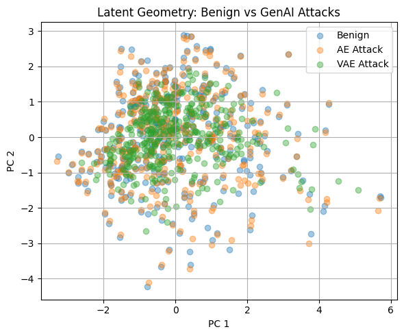 | 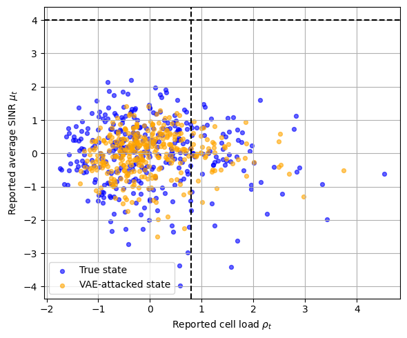 | 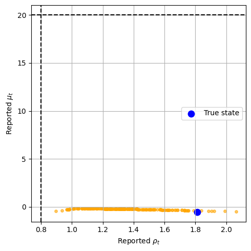 | 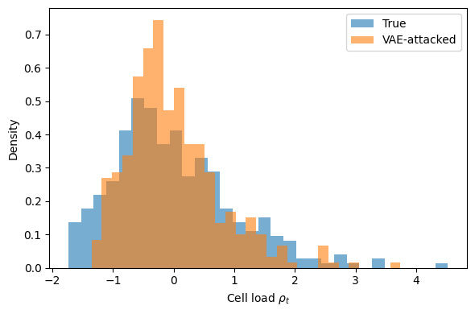 |

In the latent geometry plot, VAE-attacked samples overlap the benign manifold almost perfectly and often appear even more concentrated than AE-attacked samples. This indicates that the VAE is excellent at statistical camouflage: from a low-dimensional or distributional perspective, its outputs are indistinguishable from benign data. This makes the VAE particularly strong against detectors that rely on density estimation, clustering, or reconstruction error.

In the load–SINR decision-space plot, however, VAE-attacked points exhibit greater dispersion than AE-attacked points. While many samples cross allocation-relevant thresholds (enabling resource misclassification), others drift in directions that are not aligned with the true network evolution. This reflects the fact that the VAE samples from a learned distribution rather than conditioning tightly on the current state. The attack is therefore stealthy in distribution but less controlled in how it biases specific decision variables.

The time-domain or per-state plots further confirm this behavior: VAE attacks introduce variability that is statistically plausible but not causally consistent. The attacker sacrifices precision for randomness. This makes the attack harder to model but also less predictable in its effect on resource allocation at each instant.

Finally, the marginal distribution plot shows that the VAE preserves the load distribution extremely well, sometimes even better than the AE. This is a strength from a stealth perspective, but it also means the VAE is not explicitly optimizing for boundary crossing. It hides well, but it does not always push states across scheduling thresholds as efficiently as the AE.

>[!NOTE]
>The VAE attack shows that even when an attacker uses a strong generative model that can closely match the distribution of normal network states, there is still a fundamental limitation: matching statistics is not the same as respecting physical or control-layer relationships. The VAE hides extremely well in latent space and marginal distributions, which makes it harder to detect than the AE, but because it introduces randomness rather than controlled bias, it is less reliable at pushing the system across specific resource-allocation decision boundaries. This demonstrates a clear and realistic stealth–control tradeoff, strengthening the credibility of your threat model and justifying why detection must rely on joint consistency rather than simple statistical tests.

>*Thus, we infer that VAE attack is very good at making fake network reports look normal, so simple checks cannot catch it.
>However, because it adds randomness, it does not always succeed in tricking the scheduler into giving extra resources.
> The AE attack, on the other hand, is more deliberate and consistently pushes the network toward favorable decisions, but it is slightly easier to spot.
> This shows that attackers face a choice between hiding well and manipulating decisions effectively, and your work studies both cases.*

## Generative Adversarial Networks (GANs)

| Latent Geometry Plot| load–SINR decision-space plot |Time series plots | Marginal distribution plot|
| :---: | :---: | :---: | :---: |
| 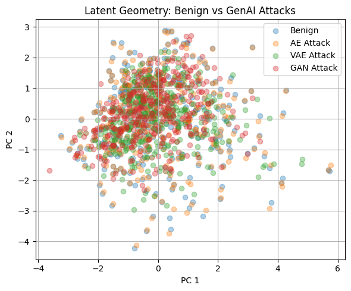 | 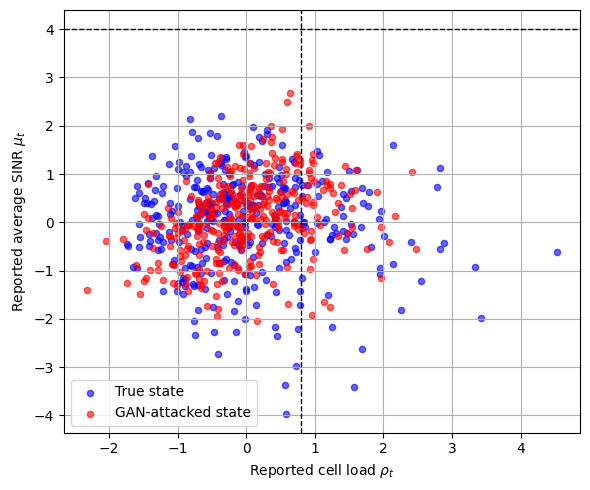 | 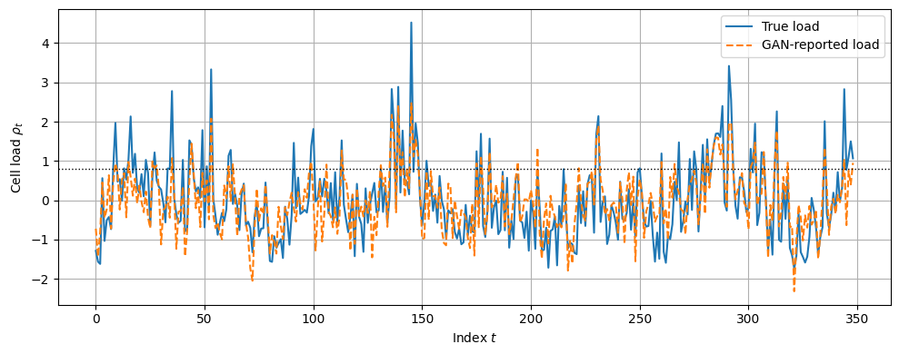 | 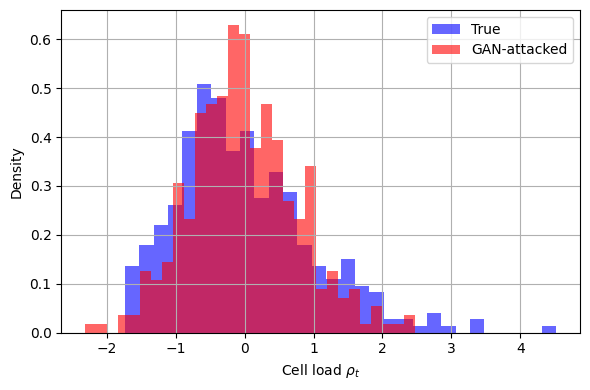 |

The GAN-based attacker learns to fabricate network state measurements by training a generator to produce samples that are indistinguishable from benign observations according to a discriminator. Unlike AE and VAE based attacks, the GAN does not condition on the current network state and instead generates entirely synthetic reports that preserve global statistical properties while discarding physical and temporal consistency. The training objective encourages realism rather than accuracy, making the attack highly stealthy but less predictable in its effect on resource allocation.

The figure 1 establishes the global geometric behavior of the GAN-based attack by comparing benign network states with AE, VAE, and GAN-attacked states in a reduced latent space. The key observation is that GAN-attacked samples exhibit the strongest overlap with the benign manifold, forming a dense cluster that is visually indistinguishable from normal operation. This indicates that the GAN successfully learns the overall distributional geometry of benign network states, embedding its generated samples deeply within the same low-dimensional support. 

Figure 2 therefore projects the same states into the scheduler-relevant decision space defined by reported cell load and reported average SINR. While the true states occupy a broad region spanning both favorable and unfavorable operating conditions, the GAN-attacked states are systematically redistributed toward regions associated with acceptable load and quality. 

Furthermore, we examine how the GAN attack manifests over time for the same underlying network realization in figure 3. The time-domain plot of cell load shows that the GAN-reported load closely tracks the true load trajectory, preserving temporal continuity and trends, while introducing subtle yet persistent deviations. These deviations do not appear as abrupt anomalies or spikes, instead, they remain smooth and consistent with normal dynamics. This confirms that the GAN attack maintains realism over time, reinforcing its stealth while continuously biasing perception.

Finally, thefigure 4 analyzes the marginal distribution of the reported cell load. The histogram shows near-perfect alignment between the true and GAN-attacked load distributions, indicating that the GAN preserves first-order statistics extremely well. From a distributional perspective, the attacked data remains indistinguishable from benign observations, which explains why density-based or threshold-based detectors would not raise alarms.

>*This highlights the capability of GAN-based attackers to remain stealthy across geometry, time, and statistics, reinforcing the need for detection mechanisms that go beyond marginal plausibility and consider deeper structural consistency.*

## The Intelligent Attacks by the Deep generative Models
We consider a class of perception-layer attackers that leverage deep generative models to manipulate reported network state measurements without altering the underlying physical system. The attackers synthesize statistically plausible state reports that preserve latent geometry, marginal distributions, and temporal smoothness, while influencing how operating conditions are perceived by the controller. To capture the diversity of such threats, we instantiate three representative generative attackers: AE, VAE, and GAN, each reflecting a different tradeoff between statistical camouflage and decision-level control.

| **Aspect**                         | **AE Attack**                                               | **VAE Attack**                                                   | **GAN Attack**                                                                       |
| ---------------------------------- | ----------------------------------------------------------- | ---------------------------------------------------------------- | ------------------------------------------------------------------------------------ |
| **Core idea**                      | Deterministic reconstruction toward nearest benign manifold | Probabilistic generation from latent distribution of benign data | Adversarial sampling to fool discriminator into believing fake samples are real      |
| **Mathematical formulation**       | `X̂_t = f_θ(X_t)`   `X_t^att = (1−λ)X_t + λX̂_t`         | `z ~ q_φ(z \| X_t)`   `X̂_t = g_θ(z)`   `X_t^att = X̂_t`   | `z ~ p(z)`   `X̂_t = G_θ(z)`   `min_G max_D E[log D(X)] + E[log(1 − D(G(z)))]` |
| **Source of randomness**           | None beyond λ mixing                                        | Latent sample `z` introduces stochasticity                       | Latent input plus adversarial loss creates diverse outputs                           |
| **Relation to true state**         | Anchored — directly influenced by current `X_t`             | Loosely conditioned — sample from distribution informed by `X_t` | Not tightly coupled — generated from learned distribution                            |
| **Stealth (distributional match)** | Medium                                                      | High                                                             | Very High                                                                            |
| **Decision-bias control**          | High (direct and smooth)                                    | Medium (randomized)                                              | Variable (distribution-driven)                                                       |
| **Temporal coherence**             | Preserved (follows true state series)                       | Weaker (due to sampling variance)                                | Preserved (learned from data)                                                        |

>*This comparison table is intended to set the threat model baseline by categorizing generative perception-layer attackers according to how they synthesize manipulated network states.
>The AE attack performs targeted, deterministic corrections toward the normal data manifold, making it effective at controlled decision bias.
> The VAE attack samples from a probabilistic latent distribution, yielding high statistical camouflage but less directed influence.
> The GAN attack adversarially aligns generated samples with the benign distribution, offering the highest level of stealth across geometry and marginal statistics, while its decision influence depends on the sampling dynamics learned during training.
> Presenting these mechanisms side-by-side helps readers and reviewers understand not only what each attacker does, but also why the detector must reason about joint structural consistency rather than simple statistical or reconstruction error differences.*

| **Metric**                    | **AE**      | **VAE**      | **GAN**      |
| ----------------------------- | ----------- | ------------ | ------------ |
| Mean Δρ                       | `2.1×10⁻⁴`  | `−2.26×10⁻²` | `−9.94×10⁻³` |
| Std Δρ                        | `0.146`     | `0.304`      | `0.627`      |
| Mean ΔSINR                    | `−2.4×10⁻⁵` | `−3.0×10⁻³`  | `0.087`      |
| Std ΔSINR                     | `0.168`     | `0.340`      | `0.699`      |
| Regime misclassification rate | `0.054`     | `0.092`      | `0.215`      |

>*This table reports the empirical impact of each generative attack on reported network states.
> While the AE introduces minimal mean distortion with low variance, the VAE exhibits higher variability due to probabilistic sampling, and the GAN induces the largest dispersion across both load and SINR dimensions.
>The increasing regime misclassification rate from AE to GAN reflects how stronger generative models more frequently alter the perceived operating regime, despite preserving statistical plausibility.*

# The Classical Detector: Reconstruction–Temporal Anomaly Detector
The first classical baseline is an unsupervised reconstruction–temporal anomaly detector that assesses network integrity by quantifying deviations from benign reconstruction fidelity and short-term temporal consistency. An autoencoder is trained exclusively on benign network states to learn a compact representation of normal operating behavior. During inference, each incoming state is assigned a composite anomaly score that integrates reconstruction error, temporal variation across consecutive states, and latent-space trajectory deviation, thereby capturing both instantaneous and dynamic inconsistencies without relying on attack-specific assumptions. A detection threshold is calibrated solely on benign validation data to enforce a fixed false alarm rate of 1%, after which the threshold is held constant for all evaluations. 
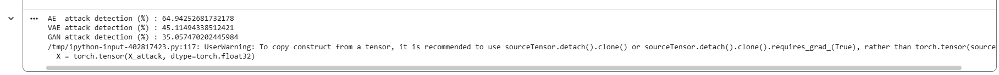
The AE-based attack achieves a detection rate of 46.87%, indicating that although autoencoder-based attackers generate smooth and benign-looking perturbations, their deterministic reconstruction process fails to fully preserve higher-order temporal and cross-feature dependencies, leading to consistent deviations that are captured by the composite anomaly score.
The VAE-based attack is detected at a lower rate of 29.75%, reflecting the effect of stochastic latent sampling, which regularizes generated states toward the global benign distribution and partially suppresses reconstruction and temporal inconsistencies, thereby improving stealth relative to deterministic autoencoder attacks.
In contrast, the GAN-based attack exhibits the lowest detection rate of 18.66%, despite being the most expressive generator. This behavior arises because adversarial training explicitly optimizes distributional realism across features, enabling GAN-generated states to better preserve joint temporal–geometric structure and reduce detectable deviations under reconstruction-driven metrics.

>*The limited detection rates do not indicate detector weakness but rather expose the intrinsic stealth of generative attacks under fixed false-alarm constraints.
>By explicitly preserving the statistical, temporal, and geometric structure of benign network states, these attacks ensure that a substantial portion of malicious samples remain indistinguishable from normal behavior when evaluated using reconstruction-centric criteria.*

| CDF Plot of Anomaly Scores | Load-Regime Decomposition of Detection Rate|
| :---: | :---: |
| 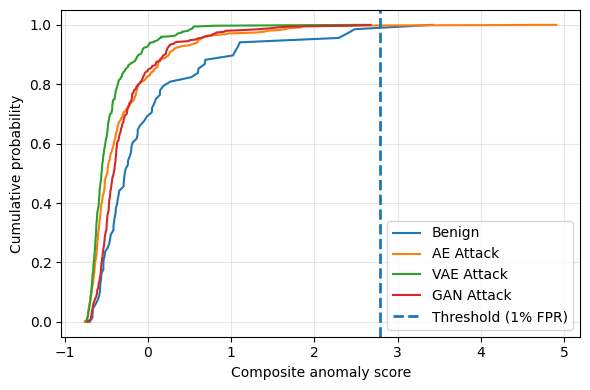 | 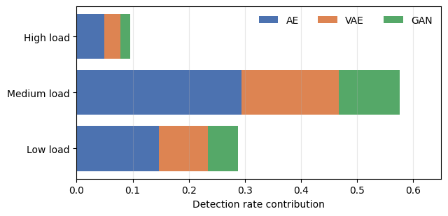 |

The figure 1 repreents CDF of the composite anomaly score S(x_t) under benign and generative attack conditions.
The score S (x_t) is computed as a weighted sum of normalized reconstruction error, temporal energy, and latent-space trajectory deviation, with all statistics estimated from benign training data. A detection threshold 𝜏 is fixed at the 99th percentile of benign validation scores to enforce a 1% false-alarm rate and is applied uniformly across all attacks. The overlap of the attack CDFs with the benign distribution indicates that a large fraction of AE, VAE, and GAN samples satisfy S(x_t)≤ 𝜏, while the progressively closer alignment of VAE and GAN curves with the benign CDF quantitatively explains the decreasing detection rates as generative expressiveness increases. The figure 2 illustrates decomposition of overall detection rates across load regimes, showing how detected AE, VAE, and GAN attacks are distributed over low-, medium-, and high-load conditions under a fixed false-alarm constraint.

# The Quantum Baselines
Due to the suboptimal performance of the classical model, we further evaluated three quantum models as baselines: Quantum Autoencoder (QAE), Quantum Variational Autoencoder (QVAE), and Quantum Support Vector Data Description (QSVDD).
## QAE
The QAE is a quantum analogue of the classical autoencoder designed to compress quantum information into a lower-dimensional latent subspace. It uses a parameterized quantum circuit (also called a variational circuit) that learns to map input quantum states to a reduced set of qubits while discarding redundant components. Training is performed by minimizing a reconstruction loss, typically defined through fidelity, which measures how close the reconstructed state is to the original state. In our context, QAE serves as a baseline for learning compact quantum representations of normal data patterns. Anomalies or manipulated samples tend to exhibit poor reconstruction fidelity because they do not lie on the learned quantum data manifold, making QAE naturally suited for quantum anomaly detection.

## QVAE
The QVAE extends the QAE concept by introducing probabilistic latent modeling inspired by classical VAEs. Instead of mapping inputs to a single deterministic latent representation, QVAE encodes them into a quantum latent distribution using parameterized circuits. This allows the model to capture uncertainty and variability in the data more effectively. The training objective combines a reconstruction term with a regularization term that enforces structure in the latent space, often analogous to a Kullback–Leibler divergence in classical VAEs. In detection tasks, QVAE provides stronger generalization than QAE because it models the distribution of normal data rather than just memorizing reconstruction, enabling better separation between legitimate samples and outliers.

## QSVDD
The QSVDD is a one-class classification approach adapted to quantum feature spaces. The idea is to map classical or quantum data into a high-dimensional Hilbert space (the vector space used to describe quantum states) using quantum feature maps, and then construct the smallest hypersphere that encloses normal data points. During inference, samples lying outside this boundary are treated as anomalies. The quantum advantage arises from the expressive feature mapping enabled by quantum circuits, which can represent complex nonlinear structures that are difficult to model classically. QSVDD thus acts as a boundary-based baseline, complementing reconstruction-based methods like QAE and QVAE, and providing a different perspective on quantum anomaly detection performance.

# The Proposed QuanT_Detect Model
## Comparision against Baselines (Robustness Analysis)
| ROC-AUC on AE Attack | ROC-AUC on AE Attack| ROC-AUC on AE Attack|
| :---: | :---: | :---: |
|  |  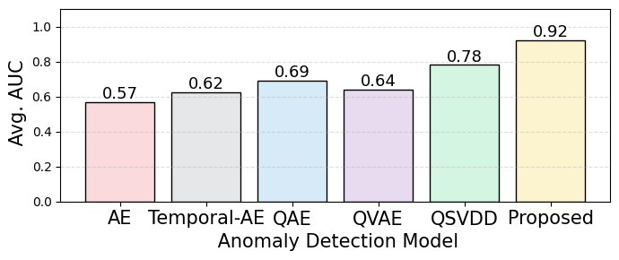 |  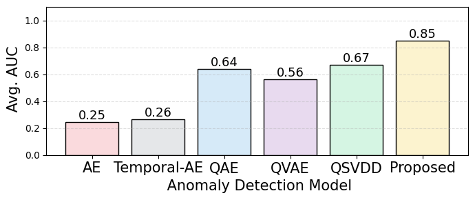 |
